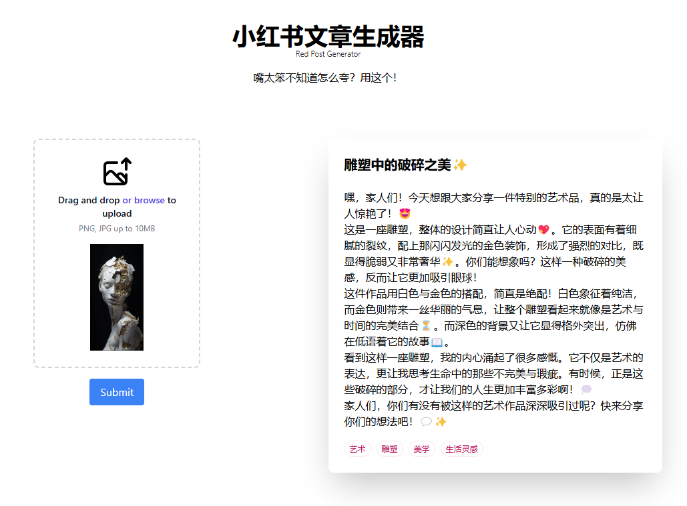

# Red Post Generator (RPG)



## Prequest

Create python venv

```bash
python -m venv venv
```

Install Python dependencies

```bash
pip install -r requirements.txt
```

Install React dependencies
```bash
cd frontend
npm install

# build static webpage
npm run build
```

###  Config
Add `config.json` file in your root path
(I use Azure OpenAI resource here)

`config.json`:
```json
{
  "OpenAI": {
    "endpoint": "YOUR ENDPOINT",
    "key": "YOUR API KEY",
    "model": "MODEL DEPLOYMENT NAME"
  }
}
```
## Test project

1. Run backend web service (Flask)
```bash
cd backend
flask run
```


# Description 

TBD